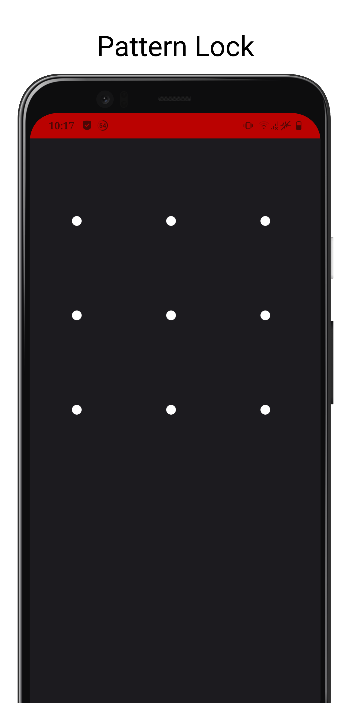

 

Secure and Private wallet for Android

<!--     
     -->
    

 

    
    
     
    

 
    
    
     
    

# Features:

* Completely Offline
* Store Your Credit cards, id cards, receipts anything you will in a wallet
* Store Important info like Medicine Names, dates etc
* Everything is encrypted and locked with a pattern
* Backup your Encrypted Database with something like seedvault
* Card Scanner
* Barcode Scanner
* Vouchers

### Coming Soon:

* Backup your Encrypted Database Manually
* Share wallet items securely with your family and friends
* UI for Photograph we put in our wallets
* Crop image and detect card
* Material You

# Have Suggestions ?

You can add an issue [here](https://github.com/abhinavmarwaha/walletx/issues) or fill up a form [here](https://forms.office.com/Pages/ResponsePage.aspx?id=DQSIkWdsW0yxEjajBLZtrQAAAAAAAAAAAANAASks135UOVZUSlZHVEVOSFRYRlJFVkMyQjI1QVVJWS4u).

# ToDo

[Roadmap](https://github.com/abhinavmarwaha/walletx/projects/1)

# Contact

You can contact me at [abhinavmarwaha@protonmail.com](mailto:abhinavmarwaha@protonmail.com) or [discord](https://discord.gg/wjAsZGD83T)

# Support

Best way is UPI at abhinavmarwaha@ybl
 
Btc -> 35Tzo8hTsggF2YENmBUc4ZiMjCKNYjgmHH
 
[Patreon](https://www.patreon.com/abhinavmarwaha)
 
[Ko-fi](https://ko-fi.com/abhinavmarwaha)

# Credits

* [sqlcipher](https://www.zetetic.net/sqlcipher/sqlcipher-for-android/)
* [encrypted-datastore](https://github.com/osipxd/encrypted-datastore)
* [W-PatternLock](https://github.com/amirhwsyn/W-PatternLock)
* <a href="https://www.flaticon.com/free-icons/wallet" title="wallet icon">Wallet icon created by Smashicons - Flaticon</a>
* Learnt a lot by reading the codebase of [Feeder](https://gitlab.com/spacecowboy/Feeder/)
* really inspired by [Syphon](https://github.com/syphon-org/syphon)
* vouchers inspired from [Catima](https://github.com/CatimaLoyalty/Android)
